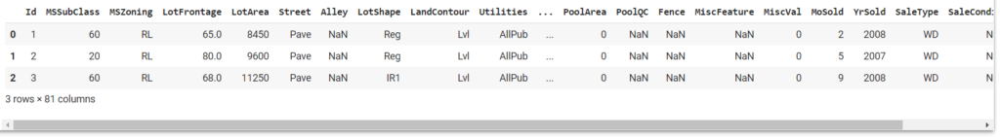

# House Prices do Kaggle – Tecnicas de Regressão


Neste projeto utilizamos um dataset que possui dados reais de preços de casas para realizar previsões. Além de técnicas de importação e manipulação de dados, são demostradas a plotagem de gráfico, bem como a criação de modelos de regressão com e técnicas de avaliação de precisão.

- Vamos utilizar o dataset disponível no Kaggle. Este é um dataset de competição. 
- Temos uma base com a descrição de cada uma das colunas (data_description.txt)


### 1) Tecnologias e bibliotecas utilizadas:
- [Python](https://www.python.org/)
- [JupyterLab](https://jupyter.org/)
- [Pandas](https://pandas.pydata.org/)
- [Matplotlib](https://matplotlib.org/)
- [Scikit-learn](https://scikit-learn.org/stable/index.html)

### 2) Arquivos utilizados no projeto
[test.csv](data/test.csv)
[train.csv](data/train.csv)
[data_desrciption.txt](data/data_description.txt)


### 3) Iniciando o Projeto
para dar início ao projeto, importaremos o pandas e faremos a leitura da base de treino para um dataframe.

```
# Importando o pandas

import pandas as pd

# Importando o dataset de treino

base = pd.read_csv('train.csv')

# Visualizando essa base

base.head(3)
```


### 4) Tratamento e preparação da base inicial
Neste passo realizaremos ajustes para a geração de uma base inicial. Para isso,  vamos verificar diversas informações da base, comoÇ tipos de dados e quantidade de valores nulos.
Após a criação da base inicial, criaremos um primeiro modelo, no qual serão escolhidos alguns algoritmos de teste e um método para avaliação de erros, com o qual verificaremos a precisão do modelo. Esta verificação nos possibilitará um melhor planejamento quanto à modelagem dos dados.
É importante observar, a partir do "shape" do Dataframe que nossa base de treino não tem um número tão grande de linhas, entretanto 81 é um número muito grande de colunas para esta base. Temos então uma grande chance de ocorência de overfitting.


```
# Retornando o shape da base
base.shape

# E as informações
base.info()

# Visualizando quantidade de valores vazios
(base.isnull().sum()/base.shape[0]).sort_values(ascending=False).head(20)

# Podemos eliminar as colunas com mais de 10% de valores vazios
eliminar = base.columns[(base.isnull().sum()/base.shape[0]) > 0.1]

# Eliminando essas colunas
base = base.drop(eliminar,axis=1)

# Selecionando apenas as colunas numéricas
colunas = base.columns[base.dtypes != 'object']

# E criar uma nova base com esses valores
base2 = base.loc[:,colunas]
base2.head(5)

# Verificando os valores vazios
base2.isnull().sum().sort_values(ascending=False).head(5)

# Substituindo os valores vazios por -1
base2 = base2.fillna(-1)

```


### 5) Criação dos Modelos

Para inciarmos a criação de nossos modelos, realizaremos a separação das variáveis X e y para realização do "split" do sklearn na base, que realizará a divisão das porções de dados de treino e teste.
Com a base separada, utilizaremos os algoritmos listados abaixo para criação de nossos modelos:
- [Regressão Linear](https://scikit-learn.org/stable/modules/generated/sklearn.linear_model.LinearRegression.html)
- [Árvore de Regressão](https://scikit-learn.org/stable/modules/tree.html#regression)
-[KNeighborsRegressor](https://scikit-learn.org/stable/modules/generated/sklearn.neighbors.KNeighborsRegressor.html#sklearn.neighbors.KNeighborsRegressor)


```
# Selecionando X e y
X = base2.drop('SalePrice',axis=1)
y = base2.SalePrice

# Importando o train_test_split
from sklearn.model_selection import train_test_split

# Separando essa base em treino e teste
X_train, X_test, y_train, y_test = train_test_split(X, y, test_size=0.33, random_state=42)

# Importando a regressão linear
from sklearn.linear_model import LinearRegression

# Criando o regressor e fazendo o fit com os dados de treino
reg_rl = LinearRegression().fit(X_train, y_train)

# Fazendo a previsão pros dados de teste
y_rl = reg_rl.predict(X_test)

# Importando a árvore de regressão
from sklearn import tree

# Criando o regressor e fazendo o fit com os dados de treino
reg_ar = tree.DecisionTreeRegressor(random_state=42).fit(X_train, y_train)

# Fazendo a previsão
y_ar = reg_ar.predict(X_test)

# Importando o KNN
from sklearn.neighbors import KNeighborsRegressor

# Criando o regressor e fazendo o fit com os dados de treino
reg_knn = KNeighborsRegressor(n_neighbors=2).fit(X_train, y_train)

# Fazendo a previsão
y_knn = reg_knn.predict(X_test)

```

### 5) Avaliando a precisão dos modelos

Realizaremos a avaliação da precisão dos modelos criados, a partir dos dados gerados nas previsões, utilizando as técnicas abaixo:

- [Erro Médio Absoluto](https://scikit-learn.org/stable/modules/generated/sklearn.metrics.mean_absolute_error.html)
- [Erro Quadrático Médio](https://scikit-learn.org/stable/modules/generated/sklearn.metrics.mean_squared_error.html)


```
# Importando o erro médio absoluto
from sklearn.metrics import mean_absolute_error

# E o erro quadrático médio
from sklearn.metrics import mean_squared_error
```

#### Avaliando erros da Regressão Linear
```
# Avaliando o erro da regressão
print(mean_absolute_error(y_test,y_rl))
print(mean_squared_error(y_test,y_rl))

```
resultado:
```
23763.187393065116
1533982883.4448853
```
#### Avaliando erros da Árvore de Decisão
```
# da árvore de decisão
print(mean_absolute_error(y_test,y_ar))
print(mean_squared_error(y_test,y_ar))

```
resultado:
```
27580.78838174274
2530245114.701245
```
#### Avaliando erros do KNeighor Regressor
```
# e do knn
print(mean_absolute_error(y_test,y_knn))
print(mean_squared_error(y_test,y_knn))

```
resultado:
```
33273.08298755187
2733937586.841286
```

Podemos plotar visualmente a relação dos resultados dos testes com as previsões realizadas. Para isso utilizaremos o MatPlotLib.

```
# Importando o matplotlib
import matplotlib.pyplot as plt

# Criando esse gráfico
fig, ax = plt.subplots(ncols=3,figsize=(15,5))

ax[0].scatter(y_test/100000,y_rl/100000)
ax[0].plot([0,700000],[0,700000],'--r')
ax[1].scatter(y_test/100000,y_ar/100000)
ax[1].plot([0,700000],[0,700000],'--r')
ax[2].scatter(y_test/100000,y_knn/100000)
ax[2].plot([0,700000],[0,700000],'--r')

ax[0].set(xlim=(0, 7),ylim=(0, 7))
ax[0].set_xlabel('Real')
ax[0].set_ylabel('Previsão')
ax[1].set(xlim=(0, 7),ylim=(0, 7))
ax[1].set_xlabel('Real')
ax[1].set_ylabel('Previsão')
ax[2].set(xlim=(0, 7),ylim=(0, 7))
ax[2].set_xlabel('Real')
ax[2].set_ylabel('Previsão')

plt.show()

```


Observamos portanto que a Regressão linear, para este caso foi a algoritmo com menor erro quadrãtico médio, a mesma métrica utilizada pelo Kaggle para classificar os modelos.

### 6) Póximos passos
Visando a melhoria dos resultados e aumento da acuracia do modelo, deve ser aplicadas técnicas de Feature Engeenering para limpeza, normalizção e padronização dos dados.


### 7) Links Interessantes:
- [Github - COVID19 - Classification](https://github.com/IbrahimSobh/kaggle-COVID19-Classification/blob/master/README.md?plain=1)
- [Github.io - COVID19 - Classification](https://ibrahimsobh.github.io/kaggle-COVID19-Classification/)
- [DataCamp - Data Augmentation](https://www.datacamp.com/tutorial/complete-guide-data-augmentation)